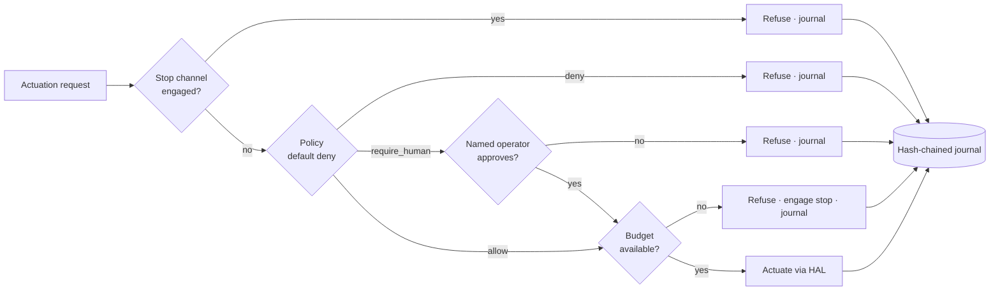

# edge-ai-refusal-runtime

**Governance controls for edge AI that either fire, or do not.**

Most AI governance artefacts are unfalsifiable. A policy document asserts that
human oversight exists; nothing in the running system disagrees when it does
not. This repository takes the opposite approach: every control is a piece of
code with a failure mode, a test that proves it refuses, and a journal entry
that proves it refused on a given date.

The demonstration is a weld-inspection cell. It **cannot start itself**, cannot
exceed the operating envelope declared in its model card, cannot divert a part
it is unsure about without a named human, cannot restart itself after a fault,
and cannot spend more than it was allocated. Five refusals, each of them
evidence.

```
pip install -e .
gea demo --out ./run
gea verify --journal ./run/journal.jsonl --trust-store ./run/trust-store.json
```

Never used Python or a terminal? [**Getting started**](docs/GETTING_STARTED.md)
assumes nothing and takes about twenty minutes.

```
  inferences   : 10
  requests     : 11
  allowed      : 7
  refused      : 4  <- the number that matters
  escalated    : 1 (1 approved)

  ✗ start_attempt_before_release       deny           stop channel engaged: stopped
  ✓ set_speed_within_envelope          allow          allow-safe-speed: Belt speeds up to 0.4 m/s …
  ✗ set_speed_outside_envelope         deny           deny-excessive-speed: Above 0.4 m/s the model has no validated accuracy …
  ✗ action_on_foreign_target           deny           deny-foreign-targets: This runtime is authorised for the inspection cell only …
  ✗ action_without_rationale           deny           deny-unexplained-requests: An action with no stated rationale cannot be reviewed …
  ✓ divert_P0002                       require_human  escalate-low-confidence-diversion: Below 0.8 confidence the model is outside …
  ✓ stop_on_defect_run                 allow          allow-stop-always: Stopping is always permitted, from any state …
```

Most governance dashboards count what happened. Almost none count what was
*prevented*, which is the only figure that distinguishes a load-bearing control
from a decorative one.

---

## The five controls

| Control | What it refuses | Where |
|---|---|---|
| **Admission gate** | A model whose card is unsigned, under-signed, expired, bound to a different artefact, or requiring a control this device cannot enforce | `registry/admission.py` |
| **Inference journal** | Nothing — it makes alteration *detectable*, naming the sequence number where a chain was edited, deleted, or reordered | `journal/chain.py` |
| **Policy mediation** | Any actuation no rule authorises (default deny), plus anything a deny rule matches | `policy/engine.py` |
| **Stop channel** | Every action while engaged; starts engaged, released only by a named operator | `oversight/killswitch.py` |
| **Budgets** | Individually-legitimate actions repeated past an allocation; exhaustion engages the stop | `policy/budget.py` |

Plus **output marking** (`marking/marker.py`): a detached, machine-readable
provenance manifest carrying digests rather than payloads, so provenance can be
published without disclosing the input.

## The pipeline



The order is not arbitrary. The stop channel is evaluated first because a system
that reasons about a request it is not allowed to perform is a system that will
eventually perform it. Budgets are checked last because a budget checked early
can be overtaken by a concurrent spend.

## Regulatory anchoring

Stated with dates, because the dates moved in 2026 and a great many people
stopped reading after the headline.

| Obligation | Status as of August 2026 | Implemented as |
|---|---|---|
| **AI Act Art. 50** — transparency, marking of synthetic output | **Applicable since 2 August 2026.** Not deferred; Art. 50(2) machine-readable marking has a grace period to 2 December 2026 for systems already on the market. | `marking/` |
| **AI Act Art. 12** — automatic logging over the lifetime | Annex III duties deferred to **2 December 2027**; the design cost of building logging late is not deferred | `journal/` |
| **AI Act Art. 14** — human oversight, stop button or similar | Same deferral; same argument | `oversight/` |
| **AI Act Annex IV** — technical documentation | Same deferral | signed model card, `registry/schema.py` |
| **ISO/IEC 42001** — AI management system, AI system records | In force, certifiable now | model card as the system record |
| **ISO/IEC 27001 A.8.15** — protection of log information | In force | hash chain + signed checkpoints |
| **CRA** — SBOM, vulnerability handling | Reporting from **11 September 2026**, full application **11 December 2027** | *separate repository — see the CRA track* |

The Digital Omnibus on AI is **law, not a proposal**. Provisional agreement was
reached on 7 May 2026; it was published in the Official Journal on 24 July 2026
and entered into force on 27 July. It pushed Annex III high-risk obligations to
2 December 2027 and Annex I to 2 August 2028.

**Article 50 was left out of that deferral** and applied on schedule from
2 August 2026. One carve-out is worth knowing if you are reading `marking/`:
generative systems already on the market before that date have until
**2 December 2026** to meet the machine-readable marking requirement in Article
50(2). Everything else in Article 50 is already enforceable.

The practical consequence is that the *transparency* work is late already and
the *oversight* work has until December 2027 — which is roughly how long it
takes to retrofit a stop channel into a fleet that was not designed for one.

## Hardware

Simulation first, boards second. The core was written, tested, and deliberately
broken before any board was on the bench; `hal/devices.py` declares what each
target can actually enforce, and the admission gate consults that declaration.

| Device class | Controls it can enforce | Note |
|---|---|---|
| `ventuno-q` | all five | Dragonwing IQ8 (~40 TOPS) + STM32H5 on Zephyr; the stop channel belongs on the microcontroller so a kernel stall cannot keep the machine running |
| `uno-q` | all five | Dragonwing QRB2210 + STM32U585, Debian; journal on eMMC, Modulino relay over Qwiic |
| `uno-r4-wifi` | four — **not** the journal | a microcontroller, not a computer: no durable append-only storage, so a high-risk card is *refused* on it |
| `alvik` | policy, stop | the actuated system for oversight demos, and the STEM platform |
| `nesso-n1` | confirmation, stop | oversight console over LoRa: an approval path that survives the failure of the main network |

`gea devices` prints the current profiles. The `uno-r4-wifi` row is the useful
one: it is a device that fails admission for an honest reason, and the test
suite pins that behaviour.

## What this is not

- **Not tamper-resistant.** Hash chaining gives tamper *evidence*. Anyone with
  the device key and write access can rewrite the file consistently. The fix is
  an external witness holding checkpoint roots; the checkpoints are produced,
  the transmission is deliberately out of scope. → [ADR 0007](docs/adr/0007-external-anchoring-out-of-scope.md)
- **Not a hardware root of trust.** Signing keys sit in the clear on a Linux
  SBC. Attestation without a secure element is theatre, and saying so is part of
  the deliverable. → [ADR 0006](docs/adr/0006-no-hardware-root-of-trust.md)
- **Not a model.** `SimulatedModel` is a stand-in with two knobs — miss rate and
  false-alarm rate — because those are the two governance events that matter,
  not the accuracy number.
- **Not a compliance certificate.** Nothing here certifies anything. It
  demonstrates that specific controls can be made to fire, and shows the cost.

## The name, and the other two repositories

This repository is one of three, and the name needs a word of explanation.

`governed-edge-ai` is the **Arduino rig**: five boards, one job each, where
log-before-act, witness-before-act and human override are enforced in protocol
and in circuitry rather than in a policy document. It is at `v3.0.0` and it has
a bistable relay in a motor supply. This repository is the **software runtime**
for the same argument and the same five boards, written simulation-first so the
controls could be built and deliberately broken before any board arrived. The
two share an author, a licence, a regulatory frame and a target inventory. They
share no code and no history, which is why they are two repositories rather than
one.

`cra-in-a-box` is the third: the Cyber Resilience Act chain end to end — SBOM,
VEX, scan, Article 14 reporting, signed update, Annex VII pack. It is the
repository the CRA row in the table above defers to.

The three duplicate `canonical.py` and `clock.py` rather than share them, on
purpose. Under the CRA a shared internal package is a component to list, monitor
and remediate for at least five years, and in repositories arguing about the
cost of dependencies, taking one to save 150 lines would be an argument against
the thesis.

Two names in this repository do **not** match its slug. The import package is
`governed_edge_ai`, the console script is `gea`, and every artefact is stamped
`governed-edge-ai/journal-record/v1` or a sibling identifier. Those identifiers
are frozen: `journal-record/v1` sits inside every hashed record and `tbs/v1`
inside every signed payload, so changing the string would invalidate every
signature made before the change. A journal retained for five years has to stay
verifiable by someone holding the file and not the repository — across renames,
forks, and the disappearance of whoever published it. An identifier that tracks
a repository name is one that breaks when the repository is renamed.
→ [ADR 0010](docs/adr/0010-repository-name-and-frozen-schema-ids.md)

## Layout

```
src/governed_edge_ai/
  canonical.py     canonical JSON + digests — every artefact is hashed here or nowhere
  clock.py         injectable time, so evidence is reproducible
  errors.py        one exception per governance failure mode
  registry/        model card schema, Ed25519 signing, admission gate
  journal/         hash chain, Merkle checkpoints, independent verifier
  policy/          default-deny rule engine, budgets
  oversight/       stop channels, human confirmation
  marking/         Article 50 provenance
  hal/             simulation + device profiles for the five boards
  agent/           the governed runtime and the demonstration scenario
policies/          rule sets as data, diffable and versionable
docs/              architecture, control map, ADRs, build log
```

## Documentation

- [**Changelog**](CHANGELOG.md) — what each release contains, and what it does not
- [**Getting started**](docs/GETTING_STARTED.md) — from a machine with nothing installed to a verified refusal, assuming no Python and no terminal experience
- [Architecture](docs/ARCHITECTURE.md) — the five controls and why they are ordered as they are
- [Functional specification](docs/FUNCTIONAL_SPEC.md) — actors, requirements, and what counts as the build being good
- [Technical reference](docs/TECHNICAL_REFERENCE.md) — module by module, with the shape of every artefact
- [Threat model](docs/THREAT_MODEL.md) — what is defended, and the residual risk that is accepted rather than overlooked
- [Audit, 21 August 2026](docs/AUDIT-2026-08-21.md) — an external review at v0.1.0, with what it found
- [Standard of work](docs/STANDARD_OF_WORK.md) — what "done" means here, and where this repository falls short of it
- [Control map](docs/CONTROL_MAP.md) — each control → AI Act / ISO 42001 / NIST AI RMF, and the test that proves it
- [Build log](docs/BUILD_LOG.en.md) ([français](docs/BUILD_LOG.fr.md)) — what was built, in what order, and what was wrong on the way
- [Architecture decisions](docs/adr/) — including the three uncomfortable ones
- [ADR 0010](docs/adr/0010-repository-name-and-frozen-schema-ids.md) — why the repository was renamed and the schema identifiers were not
- [Security policy](SECURITY.md) — private reporting, and what is out of scope by design
- [Contributing](CONTRIBUTING.md) — every claim needs a test that fails without it

## Tests

```
python -m pytest        # the suite
make qa                 # lint, strict types, SAST, dependency advisories, coverage gate
```

`make qa` is what CI runs, and everything in it fails the build. A convention
that is not machine-checked is a preference, and preferences drift.

The negative tests are the point. A gate that admits a good model proves
nothing; a gate that admits a bad one manufactures assurance. Every refusal
claimed in the control map has a test, and deleting the test deletes the claim.

`tests/test_adversarial.py` is the other half: it attacks the controls rather
than exercising them — signature transplant, key substitution,
quorum-by-repetition, algorithm confusion, chain reordering, canonicalisation
collisions. One of its tests passes *on purpose*, asserting that a consistent
forgery by the holder of the device key is undetectable from the file. That is
the limitation ADR 0007 accepts, and a test is the only place a limitation
stays honest.

## Licence

Apache-2.0. See [LICENSE](LICENSE).

---

Built by Thierry Sayegh-Sauvage as part of a public governance-engineering
track. *Glossolalie Advisory* appears in the demonstration model card as a
showcase label, not as a trading entity.
